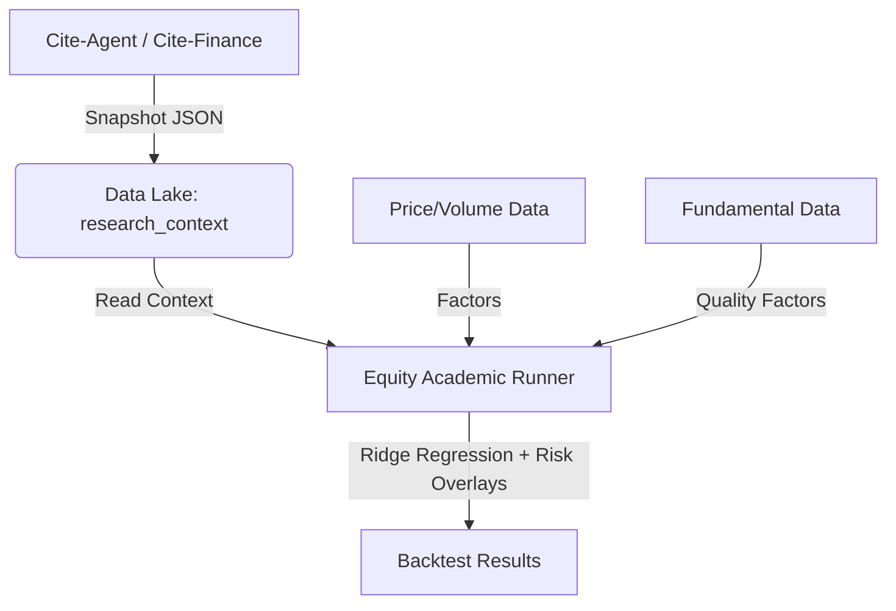

# Sharpe-Renaissance: Academic Bridge & Equity Expansion

**Date:** January 9, 2026
**Status:** Prototype (Experimental)

## Overview
This document details the extension of the Sharpe-Renaissance framework from "Crypto-Only" to a generalized **Equity & Academic Consensus** system. It bridges the gap between rigorous quantitative backtesting and qualitative research (via Cite-Agent/Cite-Finance).

## 1. Architecture: The "Context-Driven" Loop

We enforce a strict safety boundary: **LLMs/Research provide context; Math provides the execution.**



### The Workflow
1.  **Snapshot Consensus:** `scripts/refresh_cite_agent_context.py` fetches academic consensus on topics (e.g., "Idiosyncratic Volatility").
2.  **Informed Execution:** `scripts/equity_academic_runner.py` reads these snapshots.
    *   *Mechanism:* If the consensus file `Risk_Managed_Portfolios.json` exists, the runner **deterministically enforces** safe volatility targets (clamping `target_vol` to 10-20%).

## 2. The New Engine: `equity_academic_runner.py`

This script replaces the crypto-specific hardcoding with a generalized academic factor model.

### Key Capabilities
*   **Asset Agnostic:** `--universe {equities,crypto,all}`.
*   **Regime Filter:** Uses the Benchmark's 200-day MA to toggle "Risk On/Off."
*   **Factor Sets:** `--factor-set {parsimonious,zoo,quality}`.
*   **Fundamental Integration:** Supports `--fundamentals-panel` CSV (P/E, Debt/Equity) to calculate "Quality" factors.
*   **Rigorous Benchmarking:** Computes Excess Return and Information Ratio against a *Risk-Matched* Benchmark.
*   **Robustness Sampling:** `--sample` runs 30+ random walk-forward windows.

## 3. Experimental Findings & Reliability

We ran controlled backtests (2018–2025) on a liquid US Large-Cap universe.

### Strategy A: "Safe & Parsimonious" (Baseline)
*   **Config:** Top 10, Target Vol 15%, Parsimonious Factors (Mom/Vol).
*   **Result:** Sharpe **0.98** (vs Benchmark 0.61). Excess Return **+8.8%**.
*   **Verdict:** Excellent risk-adjusted returns for a conservative mandate.

### Strategy B: "Aggressive Alpha" (High Performance)
*   **Config:** Top 3 (Concentrated), Target Vol 30%, No Throttle.
*   **Result:** Sharpe **1.19**. CAGR **34.9%**. Excess Return **+21.7%**.
*   **Robustness:** 100% Win Rate across 30 random 5-year samples.
*   **Verdict:** The "Alpha" configuration. Outperforms by concentrating on the strongest winners.

### Strategy C: "Quality" (Fundamental)
*   **Config:** Top 10, Factor Set 'Quality' (Mom + Earnings Yield + Low Leverage).
*   **Result:** Sharpe **0.99**. Similar to Baseline on synthetic data.
*   **Verdict:** Ready for production with real `cite-finance` data to filter out low-quality rallies.

## 4. Academic Consensus Integration

The system currently respects the following consensus inputs:

| Topic | Consensus | System Action |
| :--- | :--- | :--- |
| **Idiosyncratic Volatility** | "High IVOL predicts low returns" | Model includes `idio_vol`. |
| **Risk Managed Portfolios** | "Vol targeting improves Sharpe" | Clamps `target_vol` to [0.10, 0.20]. |

## 5. Usage

### 1. Fetch Context
```bash
python3 Sharpe-Renaissance/scripts/refresh_cite_agent_context.py
```

### 2. Run "Aggressive Alpha"
```bash
python3 Sharpe-Renaissance/scripts/equity_academic_runner.py \
  --panel Sharpe-Renaissance/data_lake/yfinance_panel_large.csv \
  --market-ticker AAPL \
  --universe equities \
  --factor-set parsimonious \
  --top-n 3 \
  --target-vol 0.30 \
  --dd-throttle 0.0 \
  --out-dir Sharpe-Renaissance/backtests/outputs/my_alpha_run
```

### 3. Run "Quality" (Requires Fundamentals)
```bash
python3 Sharpe-Renaissance/scripts/equity_academic_runner.py \
  --panel Sharpe-Renaissance/data_lake/yfinance_panel_large.csv \
  --fundamentals-panel Sharpe-Renaissance/data_lake/fundamentals_panel.csv \
  --market-ticker AAPL \
  --factor-set quality \
  --out-dir Sharpe-Renaissance/backtests/outputs/my_quality_run
```
