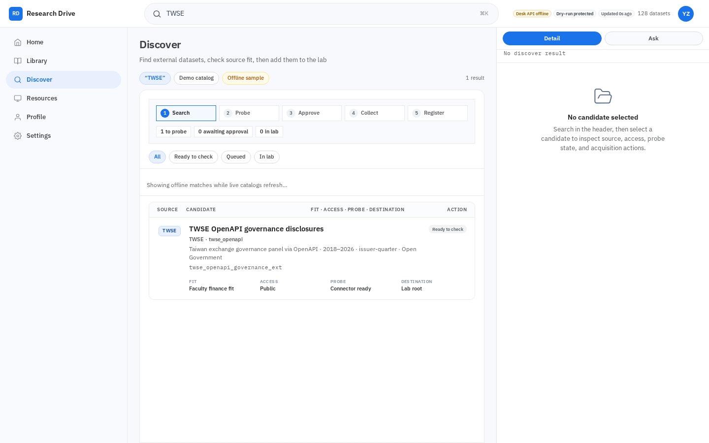

# Research Drive

**A data desk for a university research group: find a dataset, check whether it fits and can be used, collect it, and file it in the lab's library, with every step recorded.**



**Try it:** <https://spectating101.github.io/yzu-cluster/> — the interface with demo data, no install needed.

Built for a finance faculty at Yuan Ze University. A researcher searches for data (a TWSE market feed, a governance panel, a DOI), the desk checks access terms and whether the source can actually be downloaded, a person approves, and the dataset is collected into the lab vault and catalogued so the next student finds it instead of re-collecting it.

| | |
|---|---|
| **Interface** | React workspace: Home, Library, Discover, Resources, with a chat panel for asking what the lab already holds |
| **Pipeline** | Search → Probe → Approve → Collect → Register, with a human approval step before anything is collected |
| **Interfaces for tools** | REST API and MCP, so an AI assistant can query and request data through the same checks |
| **This repository** | The public interface, browser tests, product contracts and a dependency-free reference runtime |
| **Status** | Release candidate [`research-drive-rc2`](https://github.com/Spectating101/yzu-cluster/releases/tag/research-drive-rc2), used internally by one lab. No outside adoption yet. Exact refs: [`docs/CURRENCY.md`](docs/CURRENCY.md) |

The lab's live backend (API, workers, scrapers and the data itself) runs from a separate private repository and is not needed to explore the interface.


## What this is

| Promise | What professors get |
|---------|---------------------|
| **Organized lab data** | Library catalog mapped to vault partitions |
| **Procurement assistant** | Composer + MCP — search, query, collect, register |
| **Research-asset construction** | Synthesis turns research intent into validated, reusable assets |

**Not** alpha trading and not SolarPunk — those are separate products.

## Public authorities

| Path | Role |
|---|---|
| `drive/src/v2/` | Research Drive interface |
| `e2e/` | Browser and rendered-state contracts |
| `docs/product/` | Public product and interoperability contracts |
| `scripts/yzu_cluster/` | Executable dependency-free reference runtime |
| `scripts/yzu_cluster/interop_ingest.py` | Later-main labelled test ingest journey (not RC2) |
| `tests/test_yzu_interop_*.py` | Reference runtime behavioral tests |

The public reference runtime is intentionally framework-neutral. It does not contain the private host, archive, credential, or production-data environment.

## Live surfaces

| Surface | URL |
|---------|-----|
| **GitHub Pages** — static UI + demo seed | https://spectating101.github.io/yzu-cluster/ (follows GitHub `main`, not the RC2 tag) |
| **Full desk** — companion API + chat + workers | Private companion repository (access on request), pinned to the named runtime SHA |

Static Pages shows the v2 shell and offline/demo data. Composer chat and live registry require the companion API. Pages is not the RC2 live-accepted desk.

## RC2 accepted release

Research Drive RC2 is live-accepted with the implementation pins below:

| Surface | Accepted SHA |
|---|---|
| Public product | `b40ff0945f5e1957f0100742185e2a78b06dd498` |
| Private runtime | `07cb7b885454aef32f3e2351da8733794fe9c17b` |

The release truth anchor is `procured_src_b0a7ba3817a5`: it is **Registered**, queryable through the accepted runtime authority, and deliberately **not** represented as Query ready.

A later-main synthetic test ingest (`test_ingest_src_20260919` in `scripts/yzu_cluster/fixtures/test_ingest_journey_20260919/`) exercises byte-preserving ingest, synthesis, restart, worker failure, and retry on this public reference runtime. That journey is **not** RC2, **not** a GitHub Release, **not** a live acquisition, and it does **not** promote the RC2 golden asset to Query ready.

- [RC2 release notes](docs/releases/RESEARCH_DRIVE_RC2.md)
- [RC2 operator quickstart](docs/releases/RC2_OPERATOR_QUICKSTART.md)
- [Machine-readable RC2 manifest](release/research-drive-rc2.json)

Run the independent clean-checkout release gate locally:

```bash
npm ci
npx playwright install chromium --with-deps
npm run release:verify
npm run release:test
npm run release:package
```

## Run locally

### Frontend and public fixtures

```bash
npm install
npm run dev
# proxy → :8765 when a private API is available
```

### Full desk

Requires the private companion repository, pinned to the named runtime SHA. Access on request:

```bash
bash drive/scripts/run_yzu_cluster.sh
# UI → http://127.0.0.1:5178
# API → http://127.0.0.1:8765
```

Do not infer that a Python facade in this public history is the deployed backend. A public module that imports absent private packages is transitional and not a runnable authority.

## Validation

```bash
npm run build
npm run test:runtime-contract
python -m unittest discover -s tests -p "test_yzu_interop_*.py" -v
npm run release:verify
npm run release:test
```

Rendered review uses the Playwright suites under `e2e/` and, when the companion desk is available, the live integration capture scripts.

`npm run release:package` creates a deterministic public static distribution, file inventory, and SHA-256 checksums under `artifacts/`. It never packages the companion control plane, secrets, registry data, or collected datasets.

## Canon docs

- [`docs/CLAIMS_BOUNDARY.md`](docs/CLAIMS_BOUNDARY.md) — inspection claims and nonclaims
- [`docs/product/claims-and-nonclaims.v1.json`](docs/product/claims-and-nonclaims.v1.json) — machine-readable bound SHA/tag
- [`docs/REPOSITORY_TOPOLOGY.md`](docs/REPOSITORY_TOPOLOGY.md) — repository and release authority (older than the currency note above)
- [`docs/UI_PRODUCT_AUTHORITY.md`](docs/UI_PRODUCT_AUTHORITY.md) — interface authority
- [`docs/RESEARCH_DRIVE_RIGHT_RAIL_CONTRACT.md`](docs/RESEARCH_DRIVE_RIGHT_RAIL_CONTRACT.md) — Detail | Ask rail
- [`docs/product/SYNTHESIS_S04_PRODUCT_SPEC.md`](docs/product/SYNTHESIS_S04_PRODUCT_SPEC.md) — Synthesis product model
- [`docs/product/CLUSTER_RUNTIME_INTEROP_CONTRACT.md`](docs/product/CLUSTER_RUNTIME_INTEROP_CONTRACT.md) — public/companion runtime contract

## Publishing discipline

The public repository may receive UI, public docs, fixtures, screenshots, E2E coverage, and reference-contract code. It must not receive credentials, host inventory, databases, local datasets, GDrive configuration, or the production control plane.

Historical and superseded PR branches remain available for archaeology, but only one cumulative public release PR should remain active.

## Share line

> Research Drive is a research data desk: organized vault catalog, registered-asset query against a named runtime, and a Composer-backed procurement loop. RC2 is the named public candidate. This is not a Yuan Ze University deployment claim.
